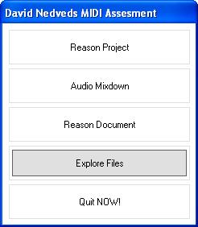



## Create a CD Autorun, Shell Files Off CD, WORKS\!

### Description

This Project is a Simple Autorun that I had to create for a Music Production Assignment. I decided to upload it and Stick it on PSC so beginners can understand how to use Functions like ShellExecute. The main idea of using ShellExecute Rather than using ordinary Shell is so files can be opened off a CD Rom. Try it out, it is only very basic, but I did include a more sophisticated way of using the &#8216;Autorun.inf&#8217; file so people understand the basics of Using Shell on an Autorun EXE and INF File.

Like always PLEASE leave your comments and votes, I know it is simple, but people who post on PSC do like feedback.

P.S. If you want to download the Full version of the Reason Project, Audio Mix Down, Code, MIDI etc. please download from this link (Aprox 5mb file)

http://www.datosoftware.com/PSC/AutorunSample.zip
 
### More Info
 

             |
---                |---
**Submitted On**   |2005-11-01 16:23:22
**By**             |[Dave Nedved](https://github.com/Planet-Source-Code/PSCIndex/blob/master/ByAuthor/dave-nedved.md)
**Level**          |Beginner
**User Rating**    |5.0 (10 globes from 2 users)
**Compatibility**  |VB 5\.0, VB 6\.0
**Category**       |[Miscellaneous](https://github.com/Planet-Source-Code/PSCIndex/blob/master/ByCategory/miscellaneous__1-1.md)
**World**          |[Visual Basic](https://github.com/Planet-Source-Code/PSCIndex/blob/master/ByWorld/visual-basic.md)
**Archive File**   |[Create\_a\_C1944971112005\.zip](https://github.com/Planet-Source-Code/dave-nedved-create-a-cd-autorun-shell-files-off-cd-works__1-63099/archive/master.zip)

